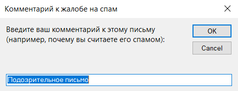
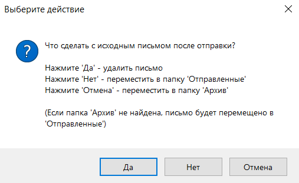

# 📧 OutlookSpamButton

<div align="center">
  
  
  
  
  
  <p><strong>Отправка спама в один клик! 🚀</strong></p>
  <p>Модуль VBA для Microsoft Outlook, который добавляет кнопку "Отправить как спам" для быстрой жалобы на подозрительные письма.</p>
</div>

---

## ✨ Возможности

| Функция | Описание |
|---------|----------|
| 📨 Отправка в один клик | Выделите письмо и нажмите кнопку — всё готово! |
| 💬 Добавление комментария | Объясните, почему вы считаете письмо подозрительным |
| 📅 Автоматическая дата | Время отправки автоматически добавляется в тело письма |
| 🗂️ Выбор действия | Удалить, переместить в "Отправленные" или в "Архив" |
| 🔒 Открытый код | Код прозрачен — вы можете просмотреть его перед использованием |
| 🌍 Русский язык | Все диалоговые окна на русском языке |

---

## 🖼️ Как это выглядит

<div align="center">
  <table>
    <tr>
      <td></td>
      <td></td>
    </tr>
    <tr>
      <td align="center"><em>📝 Ввод комментария</em></td>
      <td align="center"><em>🗂️ Выбор действия</em></td>
    </tr>
  </table>
</div>

---

## 📋 Как это работает

1. 📧 Выделите письмо в папке "Входящие"
2. 🔘 Нажмите кнопку "Отправить как спам"
3. 💬 Введите комментарий
4. 🗂️ Выберите действие для исходного письма:
   - **Да** → удалить
   - **Нет** → переместить в "Отправленные"
   - **Отмена** → переместить в "Архив"
5. ✅ Готово!

### 📧 Пример отправленного письма

> **Тема:** REPORT SPAM: Важный счет от банка
>
> **Тело письма:**
>
> ```
> Жалоба на подозрительное письмо.
>
> Дата и время отправки: 28.07.2026 14:35:22
>
> Комментарий отправителя:
> ---
> Это письмо пришло с незнакомого адреса и просит перейти по ссылке
> ---
>
> Исходное письмо прикреплено к этому сообщению как вложение.
> ```

---

## 🚀 Установка

### Шаг 1: Включите вкладку "Разработчик"

1. Откройте Outlook
2. Перейдите в **Файл → Параметры → Настроить ленту**
3. В правой части, в разделе **Основные вкладки**, поставьте галочку ✅ **Разработчик**
4. Нажмите **OK**

### Шаг 2: Импортируйте модуль

**Вариант А — импорт файла:**

1. На вкладке **Разработчик** нажмите **Visual Basic** (или нажмите `Alt+F11`)
2. В открывшемся редакторе VBA перейдите в **Файл → Импортировать файл...**
3. Выберите файл `OutlookSpamButton.bas` из этого репозитория
4. Модуль появится в папке **Модули** в левой панели

**Вариант Б — создание вручную:**

1. В редакторе VBA: **Insert → Module**
2. Скопируйте весь код из `OutlookSpamButton.bas` в новый модуль
3. Сохраните: **Файл → Сохранить VbaProject.OTM**

### Шаг 3: Настройка адреса получателя (опционально)

Чтобы изменить адрес, откройте модуль и найдите строку:

```vba
Public Const SPAM_REPORT_EMAIL As String = "Введите сюда адрес почты" '<---Поставить свою почту'
```

Замените email на нужный вам.

### Шаг 4: Добавьте кнопку на ленту

1. В Outlook перейдите в **Файл → Параметры → Настроить ленту**
2. Выберите вкладку, куда хотите добавить кнопку (например, "Главная")
3. Нажмите **Создать группу** → переименуйте её (например, "Спам")
4. В левом списке **Выбрать команды из** выберите **Макросы**
5. Выберите макрос `ForwardAndDeleteSpam` и нажмите **Добавить →**
6. Чтобы изменить название и иконку кнопки, нажмите **Переименовать...**
7. Нажмите **OK** для сохранения

### Шаг 5: Разрешите выполнение макросов

⚠️ **Важно:** Outlook по умолчанию блокирует макросы. Вам нужно разрешить их выполнение.

1. В Outlook: **Файл → Параметры → Центр управления безопасностью**
2. Нажмите **Параметры центра управления безопасностью...**
3. Выберите **Настройки макросов**
4. Выберите один из вариантов:
   - ✅ **Включить все макросы** (для теста)
   - ✅ **Включить макросы с уведомлением** (рекомендуется)
5. Убедитесь, что включено: ✅ **Доверять доступу к объектной модели VBA**
6. Нажмите **OK → OK**
7. Перезапустите Outlook

---

## 🎯 Использование

1. 📧 Выделите письмо в папке "Входящие"
2. 🔘 Нажмите кнопку "Отправить как спам" (или запустите макрос через вкладку **Разработчик → Макросы**)
3. 💬 Введите комментарий в появившемся окне
4. 🗂️ Выберите действие для исходного письма:
   - **Да** → удалить
   - **Нет** → переместить в "Отправленные"
   - **Отмена** → переместить в "Архив"
5. ✅ Готово! Письмо отправлено, а исходное обработано согласно вашему выбору

---

## 🔧 Устранение неполадок

| Проблема | Решение |
|----------|---------|
| ❌ **"The macros in this project are disabled"** | Включите макросы в Центре управления безопасностью. Или разблокируйте файл `VbaProject.OTM` в папке `%AppData%\Microsoft\Outlook\` |
| ❌ **Кнопка не появляется на ленте** | Проверьте, что вы добавили макрос в **Макросы**, а не просто вставили код. Перезапустите Outlook |
| ❌ **Письма не отправляются** | Убедитесь, что у вас настроена учетная запись Outlook. Проверьте, что в настройках разрешена отправка через VBA |

---

## 📁 Структура проекта

```
OutlookSpamButton/
├── OutlookSpamButton.bas          # Основной VBA-модуль
├── README.md                      # ПрочтиМеня)
└── images/                        # Скриншоты (опционально)
```

---

## 🤝 Вклад в проект

Буду рад любым улучшениям! Создавайте Issue или Pull Request, если хотите предложить изменения.

---

## 📞 Контакты

Если у вас есть вопросы или предложения, создайте Issue в этом репозитории.

---

<div align="center">
  <sub>Built with ❤️ for a spam-free inbox</sub>
</div>
